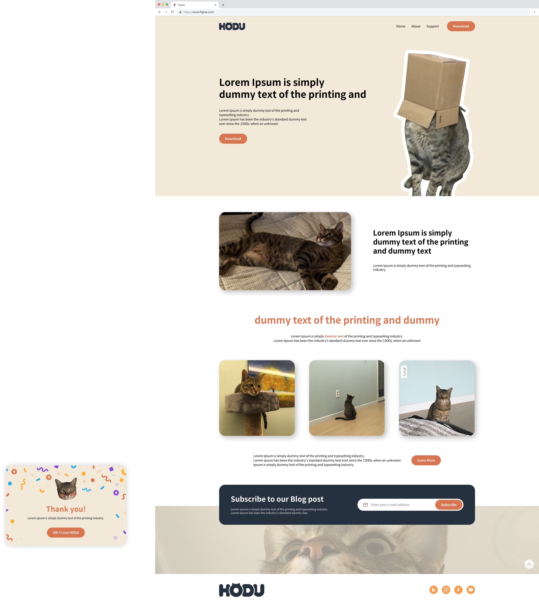
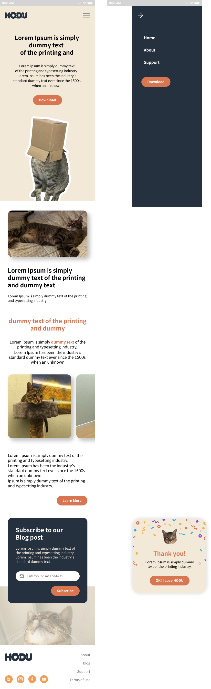

# 호두 랜딩 페이지

## 호두라는 고양이를 소개하는 랜딩페이지

## 1.목표와 기능

### 1-1 목표

- 페이지 완성
- 피그마와 동일하게 페이지 구현
- 모바일과 데스크톱 고려하여 반응형으로 페이지 구현
- 시멘틱 마크업, 웹 접근성, SEO, BEM 고려하여 페이지 구현
- 미디어쿼리, 유동적인 레이아웃, 플렉스 박스를 이용한 페이지 구현

### 1-2 기능

1. HTML
* 시멘틱 마크업: HTML의 의미에 맞게 ```<header>, <nav>, <main>, <footer>, <article>, <section>```
등의 태그 사용 - 웹 접근성, SEO, 그리고 코드의 가독성을 높이기
* 접근성(Accessibility): 신체적 제약이 있는 사용자들이 웹사이트를 이용하는 데 어려움이 없도록 시멘틱 마크업을 사용하고, alt 텍스트 제공
* SEO(Search Engine Optimization): 검색 엔진이 웹사이트의 정보를 잘 수집하고 순위를 매길 수 있도록 하는 최적화 작업 -
시멘틱 마크업, 올바른 제목 태그 사용 등

2. CSS
*  CSS 미디어 쿼리(Media Queries): 화면 크기, 해상도 등 다양한 조건에 따라 다른 CSS 스타일을 적용
* BEM(Block, Element, Modifier): CSS를 체계적으로 관리하고 유지보수를 용이하게 하기 위해 적용
       
### 1-3 팀 구성
- 이상민 - 개인 프로젝트로 1인 개발


## 2. 개발 환경 및 배포 URL

### 2-1 개발 환경
- VSCode

### 2-2 배포 URL
- https://qwezxc3810.github.io/HODU-Landing-Pages/


## 3. 요구사항 명세와 기능 명세

- 피그마를 참고하여 페이지 구현을 합니다.
- 시멘틱 마크업, 반응형 웹, 접근성, SEO, CSS 네이밍 방법론 등을 고려해서 작업해주세요.
- 모바일 화면도 고려하여 페이지 구현을 합니다.
- 스크롤시 헤더가 고정되게 합니다. 
- 구독하기 모달창의 경우 퍼블리싱 해주신 후 화면에서 보이지 않게 숨김처리 해주시고 발표할 때 노출로 전환해서 보여주세요.
- 자바스크립트로 추후 구현할 리스트
    1. 스크롤 탑 버튼
        1-1. 스크롤 탑 버튼은 스크롤시 나타납니다.
        1-2. 스크롤 탑 버튼은 푸터 아래로 내려가지 않습니다.
        1-3. 스크롤 탑 버튼을 누르면 스크롤이 최상단으로 올라갑니다. (단, 부드럽게 올라가야 합니다.)
    2. 구독하기 모달창
        2-1. 이메일을 입력하고 `Subscribe` 버튼을 클릭하면 모달창이 나타납니다.
        2-2. 이메일 유효성 검사를 진행해야 합니다. (값이 들어가지 않거나 이메일 형식이 유효하지 않으면 alert 창으로 경고 문구가 떠야합니다.)
        2-3. 이메일이 잘 입력되었다면 모달창이 뜹니다. 이때 모달창의 `OK! I love HODU` 버튼을 클릭하면 form이 제출되고 모달창이 닫힙니다.
     
  [Figma](https://www.figma.com/design/rbi8px4O2GrnXN4gK0ZaLv/WENIV_FE_%EC%8B%A4%EC%8A%B5-%EC%98%88%EC%A0%9C?node-id=116293-2&p=f&t=aMQrcHq8MnUxXhnp-0 "피그마로 이동")


## 4. 프로젝트 구조와 개발 일정

4-1 프로젝트 구조
```
.
├── Demo-images
│   ├── Group 1.png
│   └── Group 2.png
├── font
│   └── SpoqaHanSansNeo_OTF_original
│       ├── LICENSE
│       ├── SpoqaHanSansNeo-Bold.otf
│       └── SpoqaHanSansNeo-Regular.otf
├── img
│   ├── arrow-left.svg
│   ├── arrow-right.svg
│   ├── blog.svg
│   ├── box-cat.png
│   ├── cat-subscribe.png
│   ├── facebook.svg
│   ├── form-modal-back-img.png
│   ├── img_1.jpg
│   ├── img_2.jpg
│   ├── img_3.jpg
│   ├── img_4.jpg
│   ├── img_5.jpg
│   ├── instagram.svg
│   ├── keyboard_arrow_up.svg
│   ├── logo.png
│   ├── logo.svg
│   ├── mail.svg
│   ├── menu.svg
│   ├── modal-bg-img.png
│   ├── top-btn.svg
│   └── youtube.svg
├── index.html
├── README.md
└── styles
    ├── base
    │   ├── font.css
    │   ├── reset.css
    │   └── variables.css
    ├── global.css
    └── layout
        ├── footer.css
        ├── header.css
        ├── main.css
        └── modal.css
```

4-2 개발 일정
25.08.07(목) ~ 25.08.12(화) (주말 제외 총 4일)


## 5. 화면

### 5-1 데스크톱 메인 화면


### 5-2 모바일 화면


## 6. 문제와 문제 해결

### 6-1 헤더 부분 고정된 패딩값으로 설정 - 데스크톱 화면에서 콘텐츠가 넓게 펴짐, 유연성 부족
* 해결방법 - padding: clamp(); 함수 사용으로 해결
(좌우만 줘야하는 상황에선 padding-inline: clamp(); 로 해결)

### 6-2 메인 첫번째 섹션 박스캣 이미지 위치
텍스트 콘텐츠와 플렉스 박스로 정렬하면서 섹션바깥으로 안빠졌음.
* 시도한 방법 - 포지션 앱솔루트로 top ;, right ;로 처음엔 조정했으나 뷰포트가 넓어질수록 이미지 우측 일부분이 잘리는 현상 생김.
* 해결방법 - 메인 첫번째 섹션의 박스캣이 텍스트 콘텐츠와 플렉스 박스로 모바일 화면에서는 y축 방향으로, 데스크톱에선 x축 방향으로 정렬하며 섹션 바깥으로 발 일부분이 나가야해서 transform: translateY( )를 줘서 영역 바깥으로 가서 이미지가 잘리게 보이게 해결.

### 6-3 인풋 폼 안에 버튼 위치
모바일 환경에선 버튼의 위치가 인풋 창 밑에 위치하여 있고 데스크톱에선 버튼의 위치가 인풋 창 안으로 위치함.
* 시도한 방법 - 모바일 환경에선 플렉스 박스 이용 데스크톱에선 포지션 앱솔루트 퍼센트로 위치 조정
* 문제점 - 뷰포트가 적정한 너비에서 벗어나면 좌우로 고정이 안되서 움직임
* 해결방법 - 앱솔루트 퍼센트가 아닌 픽셀 고정단위로 입력 후 해결.


## 7. 개발하며 느낀점
4주간 배운 HTML과 CSS를 바탕으로 '일만시간의 법칙'과 함께 '호두랜딩페이지'를 구현해 보았습니다.
이번 프로젝트의 첫번째 목표는 일만시간의 법칙에서와 동일하게 "기간안에 완성하자" 가 목표였기 때문에 기한 내에 프로젝트를 마무리 할 수 있어서 큰 성취감을 느꼈습니다.

호두 랜딩페이지는 부트캠프 시작 전 독학으로 먼저 접해 자신감이 있었지만, 그때는 데스크톱 버전의 페이지만 구현하는 거였고,
이번엔 반응형 웹으로 구현하려니 ‘일만 시간의 법칙’ 페이지보다 훨씬 더 어려웠습니다.

모바일 퍼스트 방식으로 작업하면서 뷰포트가 커질 때마다 레이아웃이 깨지고 요소들의 위치가 엉망이 되는 상황이 반복되어 꽤나 고생했습니다.
CSS 코드를 작성하며 세 번 정도는 처음부터 다시 시작할 만큼, 문제의 원인을 찾고 해결하는 데 어려움이 많았습니다.

이 경험을 통해 레이아웃을 처음부터 체계적으로 설계하는 것이 매우 중요하다는 것을 깨달았습니다.
아직 부족한 점이 많지만, 큰 구조에서 세부까지 점차 세밀하게 구성하는 방법을 조금씩 배우고 있습니다.

특히 이번 프로젝트에서는 플렉스 박스를 집중적으로 활용하면서, 플렉스 박스에 대한 이해도를 크게 높일 수 있었습니다.
앞으로는 같은 코드를 그리드로도 구현해보며 두 레이아웃 방식의 차이점과 장단점을 비교 분석하며 더 공부할 계획입니다.

